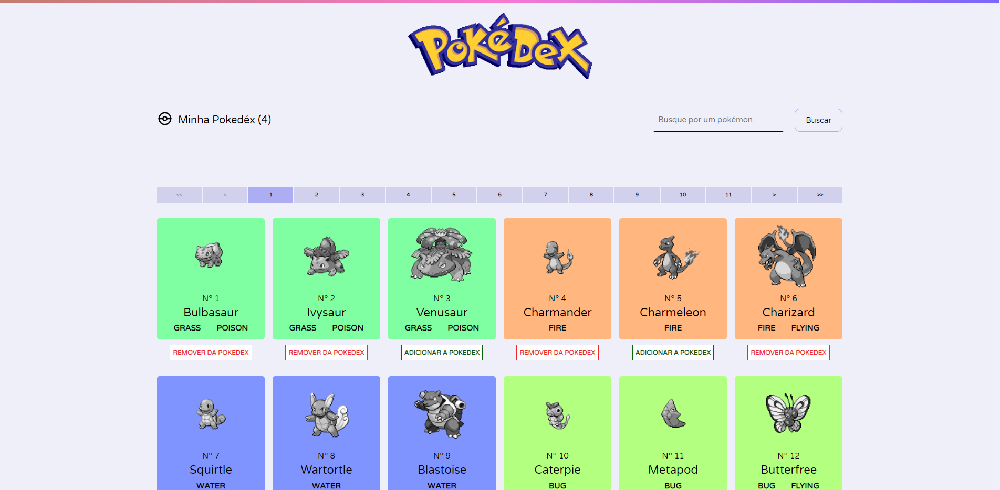
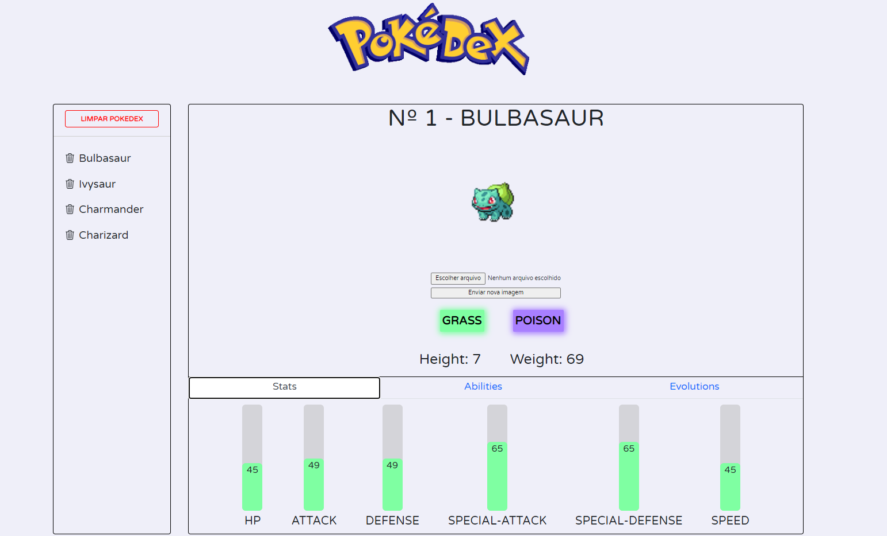
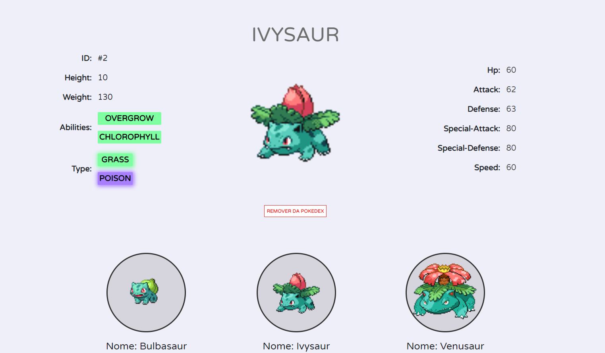
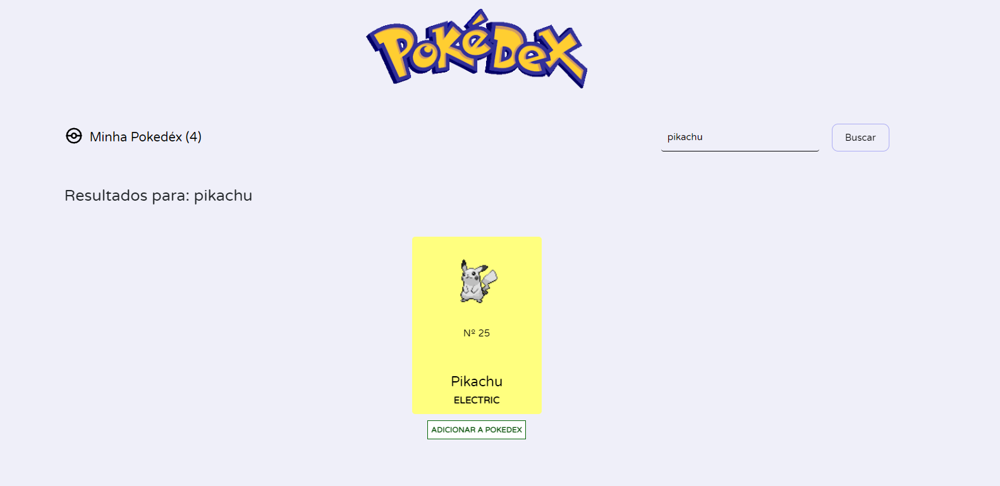

# Pokedéx in React

This project is a Pokedéx developed in React, created as part of a challenge found on the internet. The application utilizes various technologies and features to provide a complete experience for users.

## Project Description

The Pokedéx allows users to search and view information about different Pokémon. Some of the main features of the project include:

- Pokémon Listing: On the main page, users can view a list of Pokémon, displaying 48 Pokémon at a time. The list is paginated for easy navigation.
- Pokémon Details: When clicking on a specific Pokémon, users are redirected to the details page of that Pokémon. There, they can find information such as name, type(s), height, weight, stats, abilities, and evolutions.
- Add/Remove from Pokédex: Users have the option to add or remove Pokémon from their personal Pokédex. This can be done both on the Pokémon details page and directly from the Pokémon list.
- Pokémon Search: There is the ability to search for a specific Pokémon by typing the name or ID of the Pokémon in the search bar. This allows quickly finding a desired Pokémon and adding/removing it from the Pokédex.
- Pokédex View: Users can access their personal Pokédex, where all added Pokémon are displayed. Selecting a Pokémon in the Pokédex shows its detailed information, including name, type(s), height, weight, stats, abilities, and evolutions. Clicking on an ability displays more details about it, while clicking on an evolution redirects to the corresponding Pokémon page.

## Technologies Used

- [React](https://react.dev/): A JavaScript library for building user interfaces.
- [React Bootstrap](https://react-bootstrap.github.io/): A library of UI components based on Bootstrap.
- [React Icons](https://react-icons.github.io/react-icons/): A library that provides a collection of icons for use in React projects.
- [React Router DOM](https://reactrouter.com/en/main): A library that enables navigation between different pages in a React application.
- [React Redux](https://react-redux.js.org/): A library for state management based on the Redux pattern.
- [TypeScript](https://typescriptlang.org/): A superset of JavaScript with static typing to enhance the development experience, providing autocompletion and error detection during development. Commonly used with React applications for type safety and improved development.

## Project Screenshots

Here are some screenshots of the project:

_The home page provides quick access to your personal Pokédex, search for specific Pokémon, and a complete list of available Pokémon._

_The personal Pokédex page displays all Pokémon added by the user. You can remove one or all Pokémon from the Pokédex at once. Additionally, you can access detailed information about any added Pokémon, including their stats, abilities, and evolutions. It is also possible to change the Pokémon's image to any other image you prefer or like._

_On the chosen Pokémon page, you can also view all its detailed information and add or remove it from your personal Pokédex._

_The search page displays the searched Pokémon, either by name or by ID, and shows the result if the Pokémon/ID exists._

## How to Run the Project

1. Clone the repository to your local machine.
2. Install project dependencies using the command `npm install`.
3. Run the project locally using the command `npm start`.

## Acknowledgments

I would like to thank the challenge found on the internet that inspired the creation of this project, as well as the development communities that provide resources and support for building projects like this.
